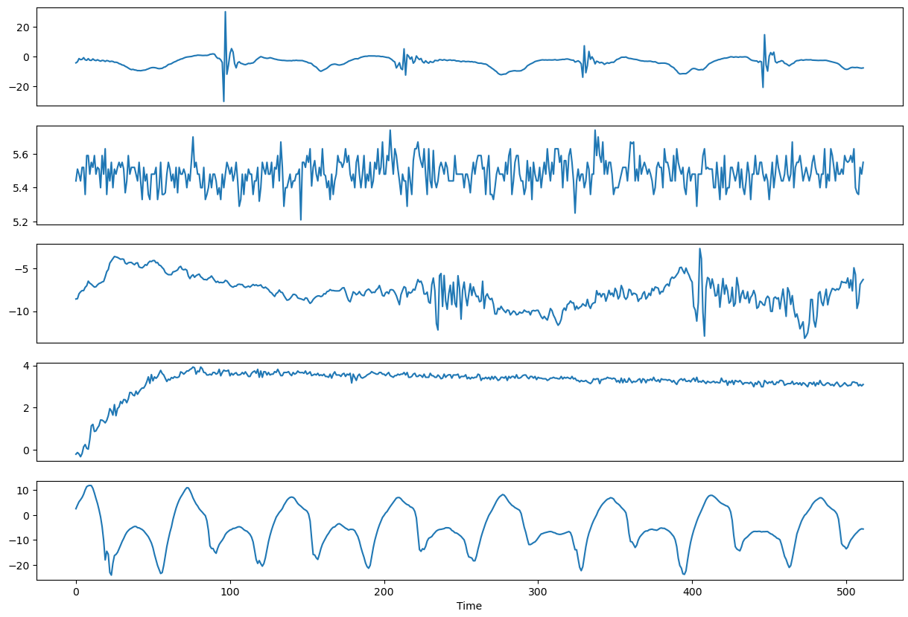
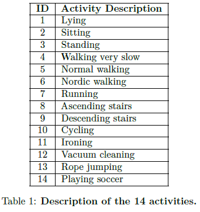
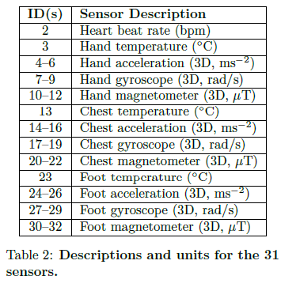

# (ELEN0062) Project 3 - Competition - Human Activity Recognition

*November 22nd, 2024*

The aim of this project is to get some experience with designing a solution to a more complex problem on large real data, using the different tools seen in the course. You will be able to compare the performance of your solution with other groups on a leaderboard during this competition, although it is obviously not the sole grading factor.
The code and data can be found on the projects website: https://iml.isach.be. Once again, the submissions will be done on Gradescope. The project must be carried out by groups of at most three students. See below for the deadlines.

## 1. Introduction

Human activity recognition is a quite impactful and important field of research, with numerous applications spanning healthcare, fitness, and lifestyle improvement. It is commonly used in technologies like smartwatches to assist in rehabilitation, monitor illnesses, and encourage healthy habits by providing actionable insights based on user activity by identifying specific actions, such as walking, running, or
sitting.

In this project, you will tackle the challenge of human activity recognition on data collected from multiple subjects engaged in various activities. The dataset includes measurements captured from a set of 31 sensors, each generating 5s-long time series data for one of 14 predefined activities.

Your task is to design a solution, based on the machine learning methods seen in class, to accurately predict the activity being performed based on the 31 time series inputs corresponding to each sensor. Considering the special nature of the data, this will involve being creative with feature engineering to feed this data to the techniques you studied.

## 2. Data

The dataset is composed of two parts, a learning and a test set. Each one contains 3,500 time series for each of the 31 sensors, possibly with missing values, encoded as -999999.99. The learning set was measured on 5 different subjects performing any of the 14 activites, and the test set was measured on 3 other subjects.

Each time series is a vector of size 512, corresponding to a duration of 5 seconds. Each sample is associated with one of the subjects. Both sets contain 31 files called ``LS_sensor_i.txt``, where each line is a time series,``LS`` is for the learning set (respectively ``TS`` for the test set), and ``i`` is the id of the sensor, from 2 to 32. Additionally, both sets contain a ``subject_Id.txt`` file, which contains the subject ID for
each of the 3,500 time series of the corresponding set.

In the learning set, you will find another file named ``activity_Id.txt``, which contains the activity being performed for each time series. This is your target to predict. The 14 activites and 31 sensors are respectively described in $Table 1$ and $Table 2$.

$Figure 1$: **Example time series for 5 different sensors.** Each one of the sensors, activities, and individuals leads to very different time series, with different scales, behaviour, periodicity, etc. Considering the time series as typical tabular features might be tedious.

## 3. Target prediction

Given the subject’s ID (``subject_Id.txt``) and the time series for each of the sensors (``TS_sensor_i.txt``), the target to predict is the ID of the activity, from 1 to 14.

The data format is the same for the learning set and the test set. We recommend you to think for some time and be creative with feature engineering and how you will locally evaluate your method.

The submission file is a simple CSV table with two columns, ``Id`` and ``Prediction``. The ID is an integer from 1 to 3500, and the prediction an integer between 1 and 14, included, corresponding to the predicted activity for the ``Id``$^t$$^h$ sample. We provide an example submission file, ``example_submission.csv``, as well as the script used to generate it, ``toy_script.py``.

## 4. Submission

The goal of the competition is to reach the best possible score (i.e., highest accuracy) on the test set
provided in ``LS``.

Your predictions computed on the data in ``LS`` can be submitted multiple times on Gradescope, where a leaderboard will allow you to compare your methods with other groups. A function to write your results in a CSV file is provided in ``toy_script.py``.

When submitting _during the competition_ , public scores will be computed on 10% of the total test set. We will obviously not disclose which subset this is. _Once the competition is over_ , new private scores will be computed on the other 90% of the set. The private scores will count as the final scores.

**_Important Note_** : Submissions are limited to _3 per group per day_. This choice is deliberate, in order to avoid overfitting the public test set. As the _private_ score is the one that counts and is computed after the end of the competition, you have no interest in overfitting the public test score. We ask you to respect this rule, even if Gradescope does not entirely enforce it. All submissions must be conscientiously done on behalf of all the members of your group. Note that you _can_ submit past the limit, but they will not count and show on the public leaderboard. However, they could count for the private leaderboard! This might be useful in case you run out of submissions on the last day. **The competition will end on December 13th at 23:59.**

## 5. Evaluation Metric

Your score will be simply computed as the accuracy, that is the percentage of correct predictions.

## 6. Report

By **_December 20th_** , you should have submitted a report along with your code on Gradescope.

Your report should describe your investigations on the data and on different approaches, along with your final approach and results. It _must_ contain the following:

- A detailed description of all the approaches you have investigated.
- A detailed description of your approach to select and assess your model.
- A table summarising the results of your different approaches.
- All tables, figures and results should be analysed in-depth while avoiding unnecessary redundancies.
- Any complementary information that you want to analyse.

Please note that the methodology and the quality of your report matter a lot. Great results on the leaderboard with poor motivations, explanations, and details in the report are definitely not what you should aim for.

## 7. Rules

You have to _strictly adhere_ to the following rules:

- Please recall the rule of 3 submissions per group per day. This is not easily enforced through Gradescope, but we ask you to respect this rule and submit conscientiously.
- You can use any techniques or algorithms you want.
- Solutions can be implemented in any language using any libraries. The only condition is that your solution should be strictly reproducible.
- You can not use external data, unless you get our approval first.
- If you use external code for algorithms, you have to give the references (even for tools or algorithms used or developed in previous projects such as Scikit-Learn).
- You can not use ready-made solutions for the problem, i.e. any available software specifically designed to solve the exact problem of human activity recognition.
